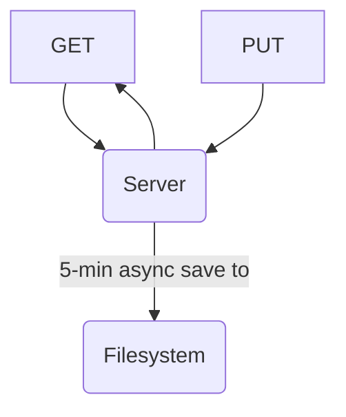

# ReplServer

A simple file-based server that is easy to fork on Replit.

## Usage

1. Create a new Node.js project on Replit.
2. In the shell, run `git clone https://github.com/WorldofKerry/ReplServer.git temp/ && bash temp/setup.sh -ex`
3. (Optionally) add custom password to Replit's Secrets using `replitSecrets.json` as the template
4. Run `npm start`

## Backlog

### Code Quality

- Replace string paths with path library

## Architecture

