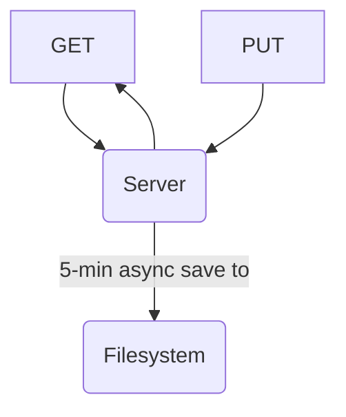

# ReplServer

A simple file-based server that is easy to fork on Replit.

## Usage
1. Create a new Node.js project on Replit.
2. In the shell, run `git clone https://github.com/WorldofKerry/ReplServer.git tmp/ && cp tmp/* . -r && rm tmp/ -rf && npm install`
3. Run `npm start`

## Architecture

