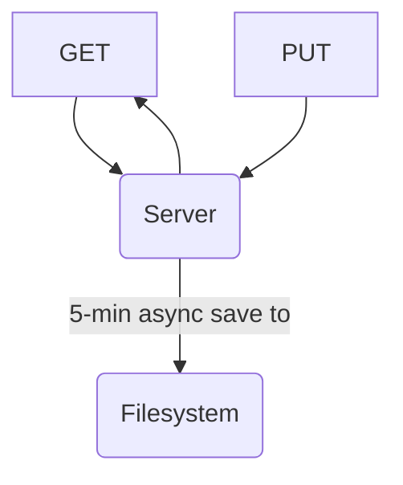

# ReplServer

A simple file-based server that is easy to fork on Replit.

## Usage

1. Create a new Node.js project on Replit.
2. In the shell, run `git clone https://github.com/WorldofKerry/ReplServer.git temp/ && bash temp/setup.sh`
3. (Optionally) change the passwords/tokens in Replit's Secrets
4. Run `npm start`

## Backlog

## Features

- Add token for delete (defaults to regular token)
- Link multiple Replits together

### Code Quality

- Replace string paths with path library
- Make STORAGE_PATH an env var

## Architecture

