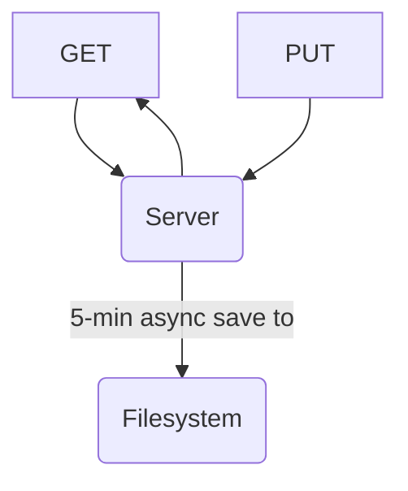

# ReplServer

(Work in progress)

A simple file-based server that is easy to fork on Replit.

## Architecture

```mermaid
flowchart

get[GET]
put[PUT]
svr(Server)
fs(Filesystem)

get --> svr
put --> svr
svr --> get
svr --> | 5-min async save to | fs

```